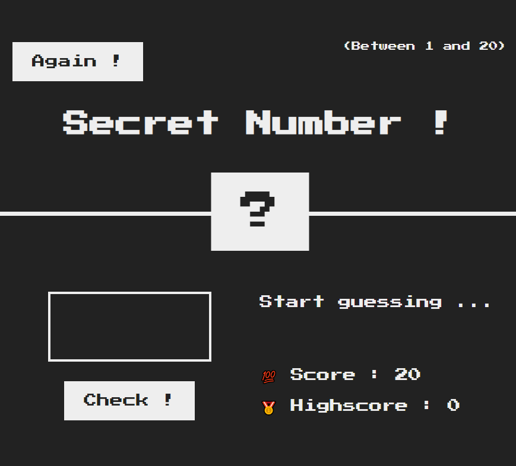

# Secret Number #️⃣

## Table of contents

- [🎯 Case Study](#case-study)
- [🧰 Toolbox](#toolbox)
- [✔️ Todo](#todo)
- [🧠 Practice](#practice)
- [🔗 Links](#links)
- [📦 Useful resources](#useful-resources)
- [😎 Author](#author)

## 🎯 Case Study

Making a game to guess a number between 1 and 20 : **The Secret Number** !

As part of my learning of JavaScript and Dom Manipulation. This exercise was created by [Jonas Schmedtmann](https://twitter.com/jonasschmedtman) for his excellent course : [The Complete JavaScript Course](https://www.udemy.com/course/the-complete-javascript-course/)

## 🧰 Toolbox

## ✔️ Todo

- [❌]
- [🚧]
- [✔️]

## 🧠 Practice

- Custom Properties
- Dom Manipulation

## 🔗 Links

## 📦 Useful resources

## 😎 Author

Hi, I'm Karibbean Creative a webdesigner and a Fullstack Coder in download. Don't hesitate to tell me what you think and connect if you want.

See u soon ✌🏽

